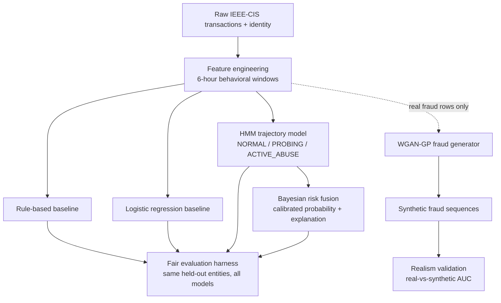

# AI Risk Manager — Behavioral Fraud Detection with HMM + Bayesian Fusion

A fraud-risk pipeline that models a merchant's customers as **behavioral sequences**, not
one-off transactions. A hidden Markov model tracks how each entity's behavior drifts over
time (`NORMAL → PROBING → ACTIVE_ABUSE`), a Bayesian evidence-fusion layer turns that
trajectory into a calibrated, explainable risk score, and a WGAN-GP conditional generator
produces synthetic fraud sequences used purely to stress-test the detector against rare
fraud typologies.

Built for Razorpay Buildathon — **Track 02: AI Risk Manager**
> *"Build a working detector, verifier or auto-responder for one class of loss, with
> measured precision and recall on a held-out test set. Honest metrics including
> false-positive cost. Strictly defense-only: anything offense-capable is disqualified."*

---

## Table of contents

1. [Why this approach](#why-this-approach)
2. [System architecture](#system-architecture)
3. [Repository structure](#repository-structure)
4. [Dataset](#dataset)
5. [Methodology](#methodology)
   - [Feature engineering](#1-feature-engineering)
   - [Baselines](#2-baselines)
   - [HMM trajectory model](#3-hmm-trajectory-model)
   - [Bayesian risk fusion](#4-bayesian-risk-fusion)
   - [Synthetic fraud generation (CGAN)](#5-synthetic-fraud-generation-cgan)
   - [Fair evaluation harness](#6-fair-evaluation-harness)
6. [How to run](#how-to-run)
7. [Results](#results)
8. [Defense-only statement](#defense-only-statement)
9. [Known limitations](#known-limitations)
10. [Roadmap](#roadmap)

---

## Why this approach

Most fraud demos train a single classifier on a snapshot of one transaction's features and
call it a day. That misses the thing fraud actually looks like in the real world: an
account behaves normally, starts probing (new devices, new emails, odd hours), then tips
into active abuse. A single-row classifier can't see that shape. A sequence model can.

Three deliberate choices follow from that:

- **A Hidden Markov Model**, not a black-box classifier, models the entity's hidden
  behavioral state over time and never sees the fraud label during training — it stays
  honestly unsupervised, then hidden states are labeled after fitting by ranking them on
  risk-oriented feature intensity.
- **Bayesian evidence fusion**, not a second neural net, combines the HMM's output with
  independent behavioral signals (device sharing, multi-email, multi-address, velocity)
  into a single calibrated probability *and* a plain-English explanation of what
  triggered it — because a risk score a merchant can't audit is not a usable risk score.
- **A conditional GAN**, trained only on the minority fraud class, generates synthetic
  fraud sequences to check whether the detector generalizes past the fraud examples it
  was trained on — real fraud data is always scarce, so this is a stress test, not a
  data-augmentation shortcut taken on faith.

## System architecture



The rule-based and logistic baselines exist so the HMM + Bayesian approach has to *earn*
its added complexity against something transparent and something standard, on the exact
same entity-level test split.

## Repository structure

```
src/
├── inspect_dataset.py            # First pass: columns, fraud rate, missing values
├── data/
│   ├── preprocess.py              # v1 feature engineering (see note on leakage below)
│   ├── preprocess_v2.py           # v2 — fixes device-sharing leakage, adds robustness
│   └── analyze_features.py        # EDA: fraud vs. legitimate feature comparison, correlations
├── baseline/
│   ├── rules.py                    # Transparent point-based rule engine
│   └── logistic.py                 # Class-balanced logistic regression on the same features
├── hmm/
│   ├── model.py                    # v1 — 3-state Gaussian HMM, threshold on state posterior
│   ├── model_v2.py                 # v2 — adds trajectory score (history + transitions)
│   └── model_v3.py                 # v3 — refined trajectory formula + F1-optimal threshold sweep
├── bayesian/
│   └── risk_model.py               # Naive-Bayes evidence fusion + HIGH/MEDIUM/LOW + explanations
├── cgan/
│   ├── train.py                    # v1 — conditional GAN, full dataset
│   ├── train_v2.py                 # v2 — fraud-only GAN + real-range clipping
│   ├── train_v3.py                 # v3 — WGAN-GP + quantile-normal transform
│   └── validate.py                 # Statistical + adversarial realism check
└── evaluation/
    └── final_evaluation.py         # Apples-to-apples comparison of all 4 approaches
```

## Dataset

This project uses the [IEEE-CIS Fraud Detection dataset](https://www.kaggle.com/c/ieee-fraud-detection)
(Kaggle competition data) as a stand-in for a merchant's live transaction stream, since it
is the largest public dataset with genuine behavioral fraud patterns and identity/device
signals similar to what a payments platform would see.

Download `train_transaction.csv` and `train_identity.csv` from Kaggle and place them at:

```
data/raw/train_transaction.csv
data/raw/train_identity.csv
```

> IEEE-CIS has no direct account ID. Every script here builds a behavioral **entity**
> from a card fingerprint (`card1_card2_card3_card5_card6`) as a proxy for "this is
> probably the same customer." This is a known simplification — see
> [Known limitations](#known-limitations).

## Methodology

### 1. Feature engineering

`preprocess.py` builds 6-hour behavioral windows per entity: transaction velocity, amount
statistics (total/mean/max/std), device diversity, device-sharing across entities, email
and address diversity, night-activity rate, and amount-change ratio versus the entity's
previous transaction.

**`preprocess_v2.py` exists because `preprocess.py` had a label-leakage bug**: the
original `device_entity_count` was computed with a full-dataset `groupby`, meaning it
implicitly used *future* transactions to describe a device's fraud-association at a given
point in time. `preprocess_v2.py` recomputes this feature **incrementally, in
chronological order, using only devices and entities seen so far** — a real detector could
never see the future, so neither should this feature. All downstream HMM, Bayesian, and
CGAN work in `_v2`/`_v3` files is built on the leakage-free version.

### 2. Baselines

- **`baseline/rules.py`** — an 11-rule point system (high velocity, shared device, rapid
  transactions, multiple emails/addresses, etc.), fully transparent and auditable by a
  compliance team with no ML background.
- **`baseline/logistic.py`** — class-balanced logistic regression on the same engineered
  features, standard practice for a fraud team without sequence modeling.

### 3. HMM trajectory model

A 3-state Gaussian HMM (`hmmlearn`) is fit on standardized, log-transformed behavioral
features per entity's chronological sequence. **The model never sees `isFraud` during
training** — hidden states are unsupervised. After fitting, the three states are labeled
`NORMAL`, `PROBING`, `ACTIVE_ABUSE` by ranking them on the mean of risk-oriented
dimensions (transaction count, amount, device/email/address diversity) — the label is
assigned *after* the fact, not learned from the target.

- **v1** thresholds the raw posterior probability of `ACTIVE_ABUSE` at a single timestep.
- **v2** introduces a **trajectory score**: a weighted blend of the current posterior,
  how many past windows were `PROBING` or `ACTIVE_ABUSE`, and whether the entity *just
  transitioned* into `ACTIVE_ABUSE` — because a fresh transition is a stronger signal
  than sustained-but-old abuse.
- **v3** refines the trajectory formula (adds a recency-weighted active count and a
  state-persistence term) and sweeps 11 thresholds to report a genuine
  precision/recall/F1 curve rather than assuming 0.5 is the right cutoff.

### 4. Bayesian risk fusion

`bayesian/risk_model.py` treats the HMM's trajectory score and five independent binary
behavioral flags (rapid activity, ≥3 devices, ≥2 payment emails, ≥2 addresses, device
shared across ≥3 entities) as evidence in a naive-Bayes odds-multiplication framework:

```
fraud_odds = prior_odds × (HMM_odds)^0.50 × (trajectory_odds)^0.75 × Π(likelihood_ratio_i)
```

Each binary flag's likelihood ratio is estimated empirically from the training data with
Laplace smoothing. The final probability is bucketed into `HIGH` / `MEDIUM` / `LOW`, and
**a plain-English explanation string is generated from exactly which evidence fired** —
this is what makes the score auditable rather than a black-box number.

### 5. Synthetic fraud generation (CGAN)

Real fraud is always a tiny, imbalanced slice of the data — hard to learn rare typologies
from, and hard to prove a detector generalizes past what it was shown. The CGAN pipeline
exists to stress-test the detector, **not to generate usable attack strategies**:

- **v1** — a conditional GAN trained on the full dataset with `isFraud` as the condition.
- **v2** — trains **only on real fraud rows**, and clips generated values to the 1st–99th
  percentile of real fraud's own feature ranges, so the generator can't wander into
  physically implausible territory.
- **v3** — upgrades to a **WGAN-GP** (Wasserstein loss with gradient penalty) plus a
  quantile-normal transform of the input features, which is materially harder to train
  stably than a vanilla GAN and produces smoother, more realistic distributions.

`cgan/validate.py` checks the synthetic data two ways: (1) mean/median/std comparison
per feature against real fraud, and (2) an adversarial test — a Random Forest is trained
to tell real fraud from synthetic fraud; **an AUC below 0.60 means the synthetic data is
statistically indistinguishable from real fraud**, which is the actual bar for "this
generator is good enough to be useful," not just "it runs."

### 6. Fair evaluation harness

`evaluation/final_evaluation.py` re-derives the **same entity-level train/test split**
(`random_state=42`) used everywhere else and scores all four approaches — rules,
logistic, HMM, Bayesian fusion — on the identical held-out entities, reporting precision,
recall, F1, ROC-AUC, and the full confusion matrix per model side by side. This is the
script to point a judge at when they ask "how do you know the fancy model is actually
better than a rule engine?"

## How to run

```bash
pip install -r requirements.txt

# 1. Inspect the raw data
python src/inspect_dataset.py

# 2. Build leakage-free behavioral features
python src/data/preprocess_v2.py
python src/data/analyze_features.py     # optional: EDA

# 3. Baselines
python src/baseline/rules.py
python src/baseline/logistic.py

# 4. HMM trajectory model (v3 is the current version)
python src/hmm/model_v3.py

# 5. Bayesian risk fusion (depends on hmm_v3_results.csv)
python src/bayesian/risk_model.py

# 6. Synthetic fraud generation + validation (v3 is the current version)
python src/cgan/train_v3.py
python src/cgan/validate.py

# 7. Fair side-by-side evaluation
python src/evaluation/final_evaluation.py
```

## Results

> Fill this table in from your own `final_evaluation.py` run before submitting — judges
> will ask for it, and "we ran it, here are the numbers" beats a promise every time.

| Model                  | Precision | Recall | F1  | ROC-AUC |
|-------------------------|-----------|--------|-----|---------|
| Rule-based baseline      |           |        |     |         |
| Logistic regression      |           |        |     |         |
| HMM trajectory           |           |        |     |         |
| Bayesian risk fusion     |           |        |     |         |

**Synthetic fraud realism (`cgan/validate.py`):** real-vs-synthetic AUC = `____`
(target: < 0.60).

## Defense-only statement

This system detects and scores fraud risk. It does not, and will not, generate exploit
strategies, evasion techniques, or anything that helps an attacker succeed. The CGAN
component exists solely to generate synthetic *risk-scoring test data* to validate the
detector's generalization — its outputs are behavioral feature vectors (transaction
counts, device counts, timing statistics), not instructions, code, or strategies for
committing fraud.

## Known limitations

- **`entity_id` is a card-fingerprint proxy, not a real account ID** — IEEE-CIS provides
  no direct customer identifier, so two different real customers sharing `card1–card6`
  values would be merged into one entity, and one customer using a genuinely different
  card would be split into two. In a live Razorpay integration this would be replaced by
  a real merchant-customer ID.
- **`TransactionDT` is a relative offset, not wall-clock time** — "night activity" is
  computed against an arbitrary reference point, not actual local time, so it's a
  behavioral-rhythm signal rather than a literally accurate day/night flag.
- **The CGAN's synthetic fraud is validated but not yet looped back into training** —
  `validate.py` proves the synthetic data is realistic, but the HMM and Bayesian models
  are not yet re-trained or re-evaluated with it as augmentation. Closing this loop and
  reporting "recall on synthetic rare-typology fraud" would be the natural next step.
- **False-positive cost is not yet quantified in rupee terms** — the evaluation reports
  precision/recall/F1, but the buildathon bar specifically asks for false-positive
  *cost*. Assigning an explicit cost to a false positive (blocked legitimate customer)
  versus a false negative (fraud loss) and reporting the cost-minimizing threshold is
  currently missing.
- **This is currently an offline batch pipeline, not a live service** — there is no API
  endpoint or demo interface that scores a transaction on request; everything runs as
  scripts over CSVs.

## Roadmap

- [ ] Quantify false-positive cost explicitly and report the cost-minimizing threshold
- [ ] Feed validated synthetic fraud back into HMM/Bayesian training as augmentation and
      report recall specifically on synthetic rare typologies
- [ ] Wrap the Bayesian risk model in a minimal API (e.g. FastAPI) that scores a
      transaction and returns `{probability, risk_level, explanation}` on request
- [ ] Add a lightweight dashboard or notebook visualizing the precision-recall curves and
      state-transition trajectories for a demo
